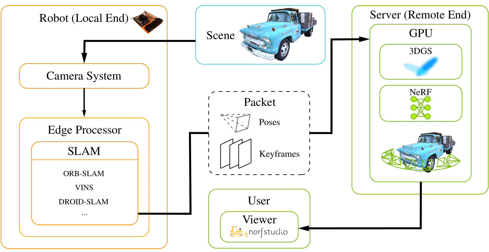

# DISORF: Distributed Online 3D Reconstruction Framework

Implementation of DISORF, a framework designed for online 3D reconstruction and visualization of scenes captured by
resource-constrained mobile robots and edge devices. Our framework, built upon
[nerfstudio](https://github.com/nerfstudio-project/nerfstudio), efficiently
distributes computation between edge devices and remote servers, leveraging
on-device SLAM for pose estimation and performing high-quality 3D reconstruction
using neural methods like NeRF and 3D Gaussian Splatting (3DGS) on powerful
servers.

[[DISORF arxiv](https://arxiv.org/abs/2403.00228)]




<https://github.com/user-attachments/assets/2707a0c2-38e3-4480-ab52-7cb890d31178>

<!-- ## Features
- **Efficient Distribution**: Distributes computational tasks between edge devices and remote servers.
- **On-Device SLAM**: Utilizes SLAM systems to generate posed keyframes on edge devices.
- **High-Quality 3D Reconstruction**: Performs online 3D reconstruction and visualization using NeRF and 3DGS.
- **Novel Sampling Method**: Implements a shifted exponential frame sampling method for improved online training.
- **Reduced Network Bandwidth**: Transmits only keyframes instead of all frames to reduce bandwidth usage. -->

## Table of Contents

1. [Installation](#installation)
2. [Quick Start](#quick-start)
3. [CLI Options Overview](#cli-options-overview)
4. [Citation](#citation)
5. [Disclaimer](#disclaimer)

## Installation

### Prerequisites

DISORF requires installation of [**ROS1**](https://wiki.ros.org/Installation) and CUDA installed.
This project has been tested on Ubuntu 20.04 with Python 3.11 and [CUDA 12.1](https://developer.nvidia.com/cuda-12-1-1-download-archive)

*Note: ROS1 is supported up to Ubuntu 20.04 only, higher versions requires [building from source](https://gist.github.com/Meltwin/fe2c15a5d7e6a8795911907f627255e0)*

Clone DISORF and submodules:

```bash
git clone https://github.com/Xiaorui-Huang/DISORF.git --recursive
# if you have already cloned DISORF
# git submodule update --init --recursive
```

### Environment Setup

```bash
conda create --name disorf python=3.10 cmake=3.14.0
conda activate disorf
pip install --upgrade pip
```

### Dependencies

```bash
pip install rospkg # ROS1
conda install -c "nvidia/label/cuda-12.1.1" cuda-toolkit # CUDA & torch
conda install pytorch==2.2.2 torchvision==0.17.2 pytorch-cuda=12.1 -c pytorch -c nvidia 
pip install ninja git+https://github.com/NVlabs/tiny-cuda-nn/#subdirectory=bindings/torch
cd libs/nerfstudio
pip install -e .
cd -
```

#### Dust3r (Optional)

```bash
# Optional Dust3r dependency for Multi-View Stereo initialization
# First time using MVS will be slow as it downloads checkpoints
cd libs/dust3r
cat <<EOF > pyproject.toml
[build-system]
requires = ["setuptools>=61.0"]
build-backend = "setuptools.build_meta"

[project]
name = "dust3r"
version = "0.1.0"

[tool.setuptools.packages.find]
include = ["dust3r*"]
EOF

pip install -e .
pip install -r requirements.txt
cd -

cd libs/dust3r/croco/models/curope/
python setup.py build_ext --inplace
cd - 
```

### Local Machine Setup

Refer to [DISORF local-end](https://github.com/Xiaorui-Huang/DISORF-local-end) for installation on the edge machine. The local-end repository is cloned as a submodule for reference, but it is not required for the server end to function.

## Quick Start

We provide

- **Streaming mode**: for real-time 3D reconstruction downstream applications
- **Replay mode**: for evaluating and experimenting with our framework

### Streaming Mode

Start the real-time streaming mode on the remote server with the following command. This will wait for keyframes from the local end SLAM module and will begin training once transmission starts.

**On the remote server**

```bash
python server_end/ros_train.py ros_gaussian_splatting `# use ros_nerfacto for NeRF` \
    --experiment-name streaming_quickstart \
    --data data/streaming_quickstart `# data output path for streaming keyframes, input path for replay mode` \
    --pipeline.datamanager.dataparser.ros-data config/camera/REPLICA_config.json \
    --pipeline.datamanager.training_sampler inverse_delta `# Our sampling method`\
    --pipeline.model.camera-optimizer.mode SO3xR3 \
    --pipeline.model.rasterize-mode antialiased `# remove for NeRF` \
    --dump_received_images True \
    --draw-training-images True \
    --vis viewer+tensorboard \
    --steps_per_eval_all_images 7000 \
    --steps_per_save 7001 \
    --max_num_iterations 7001 \
    --relocate_cameras True \
    --logging.local-writer.enable False `# disable verbose logging`
```

On a separate terminal execute the following to listen for local end keyframes:

```bash
# start roscore in the background if not already running
roscore & 
# listens on localhost:5001 by default, can supply different port as argument
python server_end/packet_to_ros.py 
```

**On the local end follow the instructions at [DISORF local-end](https://github.com/Xiaorui-Huang/DISORF-local-end)** to start the SLAM module and begin streaming keyframes to the remote server.

### Replay Mode

Requires Keyframes data from a previous streaming session

```bash
REPLAY_LOG_PATH=$(find . -path "*/outputs/streaming_quickstart/*/avail_frames_log.txt" -type f | head -n 1)
python server_end/ros_train.py ros_gaussian_splatting \
    --experiment-name replay_quickstart \
    --data data/streaming_quickstart `# data output path for streaming keyframes, input path for replay mode` \
    --pipeline.datamanager.training_sampler inverse_delta \
    --pipeline.model.camera-optimizer.mode SO3xR3 \
    --pipeline.datamanager.dataparser.ros-data config/camera/REPLICA_config.json \
    --pipeline.datamanager.replay_transmission_log $REPLAY_LOG_PATH `#remove to evaluate offline training` \
    --pipeline.datamanager.dataparser.use_cached_training_data True \
    --disable_streaming True \
    --vis viewer+tensorboard \
    --draw-training-images True \
    --steps_per_eval_all_images 7000 \
    --steps_per_save 7001 \
    --max_num_iterations 7001 \
    --logging.local-writer.enable False `# disable verbose logging`
```

We also provided a small sample dataset on Replica and Tank and Temples dataset [here](https://drive.google.com/file/d/1AJM4-vXZeK7M_ETXcQHjoY4aRf6XsDwd/view?usp=drive_link).

## CLI Options Overview

### Streaming Options

```bash
--pipeline.datamanager.dataparser.ros-data config/camera/REPLICA_config.json  # Path to JSON file for camera intrinsics, calibration, and ROS topic names
--dump_received_images True  # Save SLAM keyframes to disk for Replays
--draw-training-images  # Draw the training images in the viewer
--vis viewer+tensorboard  # Enable the viewer (default localhost:7007) and TensorBoard for visualization
--pipeline.datamanager.training_sampler [sampler]  # Select sampling strategy for data selection during training
```

### Replay Options

Of particular note is `replay_transmission_log` parameter

- The file allow a replay of how many frames were transmitted and when, allowing for consistent and repeatable training results, while simulating online training.
- without a replay log, the training will be considered `offline` and the model will have access to all frames at the start

```bash
--pipeline.datamanager.replay_transmission_log [REPLAY_PATH] 
--pipeline.datamanager.dataparser.use_cached_training_data True # Use cached training data for replay
--data [DATA_PATH]  # Path to the replay data directory
--disable_streaming True
```

#### Multi-View Stereo (MVS) w/ [DUST3R](https://github.com/naver/dust3r) Options

```bash
--pipeline.model.mvs_init True  # Initialize positions from MVS point cloud
--pipeline.model.mvs_num_random 100  # Number of Gaussians to initialize with MVS
--pipeline.model.mvs_add_every 300  # Add MVS points every specified number of steps
--pipeline.model.mvs_add_n_views 4  # Number of views to add MVS points from
--pipeline.model.mvs_add_stop_at 1000  # Stop adding MVS points at this step
--pipeline.model.mvs_sample_step 4  # Step size to sample the MVS point cloud
--pipeline.model.mvs_add_max_pts 3000  # Maximum number of MVS points to add
```

#### Optinal Arguments

```bash
# By default, all frames are evaluated.
--pipeline.eval_idx_list [EVAL_PATH] # OPTIONAL - Specify a .txt file with indices of frames for evaluation to fix a subset of frames for evaluation
--steps_per_save 1000  # Save the model every 1000 steps
--max_num_iterations 5001  # Train for a maximum of 5001 steps
--pipeline.model.camera-optimizer.mode [mode]  # Different camera optimization techniques
--num_msgs_to_start 3  # Number of images received to start training
--pipeline.model.rasterize-mode antialiased # Rasterization mode for 3DGS (see NeRFStudio help for more)
--pipeline.model.num-random 5000 # 3DGS, Number of random point cloud at init
--pipeline.model.random-scale 3 # 3DGS, Random scale for random point cloud bounding box 
--output-dir [OUTPUT_PATH]  # Output directory for training/replay logs and models, default: "outputs
# Refer to the help menu for additional options
```

### Different Sampling Strategies

- **Default**: Uniformly Randoml samples pixels/frames.
- **Inverse Delta**: Prioritizes frames that haven’t been used recently, our core sampling strategy.
- **Loss Weighted Frame**: Focuses on frames where the model performs poorly.
- **Loss Weighted Patch (NeRF only)**: Targets specific patches within frames that cause high errors.
- **IMAP**: Balances between focusing on recent and older frames as proposed by the [IMAP](https://arxiv.org/abs/2103.12352) method.
- **Hierarchical Loss**: Combines loss-weighted strategies with a hierarchical approach, focusing on both frame-level and patch-level errors.

### Streaming Preparations

Before starting a streaming session, prepare your data and camera configurations:

1. **Data Preparation**:
   - Ensure your dataset includes an `images` folder and a `transforms.json` file adjacent to it. The `transforms.json` file should contain the image poses.

2. **Camera Configuration**:
   - Calibrate your camera before running the SLAM module using the methods below:
     - [OpenCV Calibration Guide](https://docs.opencv.org/4.x/dc/dbb/tutorial_py_calibration.html)
     - [ROS1 Calibration Guide](https://wiki.ros.org/camera_calibration/Tutorials/MonocularCalibration)
    - Refer to [DISORF local end](https://github.com/Xiaorui-Huang/DISORF-local-end)

   - Example camera configurations

[iPhone X 1080p Video Mode](https://stackoverflow.com/questions/50402026/what-is-the-intrinsicmatrix-for-an-iphone-x-rear-camera)

```json
{
 "fx": 1975.47873,
 "fy": 2053.41424,
 "cx": 1060.77279,
 "cy": 513.500761,
 "k1": 0.37367123,
 "k2": -1.29505304,
 "k3": 0.92461805,
 "p1": -0.01482113,
 "p2": 0.01368264,
 "H": 1080,
 "W": 1920,
 "image_topic": "/image_raw",
 "pose_topic": "/pose",
 "pcd_topic": "/pcd"
}
```

Provided Replica Sample dataset cam config

```json
{
 "fx": 600.0,
 "fy": 600.0,
 "cx": 599.5,
 "cy": 339.5,
 "k1": 0.00023840576144970707,
 "k2": -0.00031479749960004814,
 "k3": 0,
 "p1": -7.392305313239943e-05,
 "p2": -2.771600122416197e-05,
 "H": 680,
 "W": 1200,
 "image_topic": "/image_raw",
 "pose_topic": "/pose",
 "pcd_topic": "/pcd"
}
```

### Replay Preparations

To replay a session, gather the following:

1. **Replay Log**:
   - Obtain the `avail_frames_log.txt` from the previous session’s output directory.

2. **Keyframes**:
   - Ensure you have the `images` folder and the `transforms.json` file from the original logging session.

## Citation

If you use DISORF in your research, please cite our paper:

```
@article{li2024disorf,
  title        = {{DISORF}: A Distributed Online 3D Reconstruction Framework for Mobile Robots},
  author       = {Li, Chunlin and Fan, Hanrui and Huang, Xiaorui and Liang, Ruofan and Durvasula, Sankeerth and Vijaykumar, Nandita},
  year         = {2024},
  note         = {Under review for IEEE Robotics and Automation Letters (RA-L)},
  eprint       = {2403.00228},
  archivePrefix = {arXiv},
  primaryClass = {cs.RO},
  url          = {https://arxiv.org/abs/2403.00228}
}
```

## Disclaimer

This paper has been submitted to IEEE Robotics and Automation Letters (RA-L) for possible publication. Copyright may be transferred without notice, after which this version may no longer be accessible.
